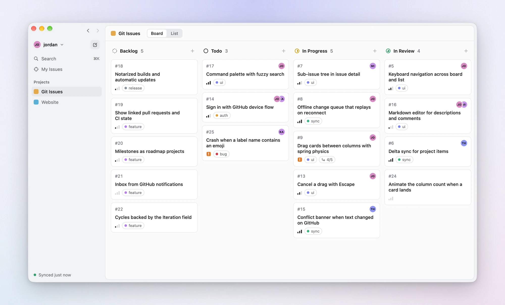
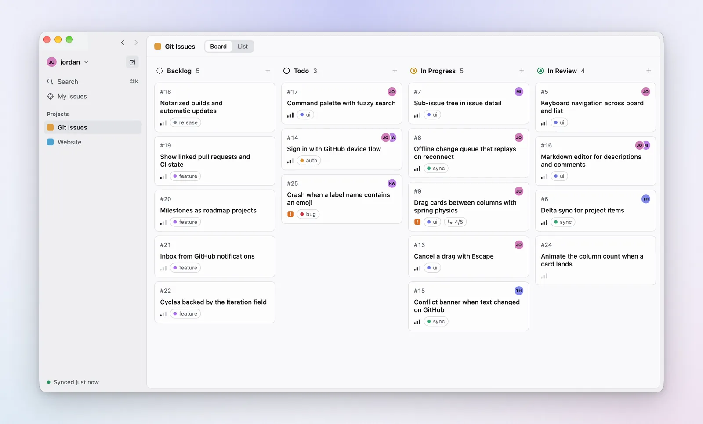
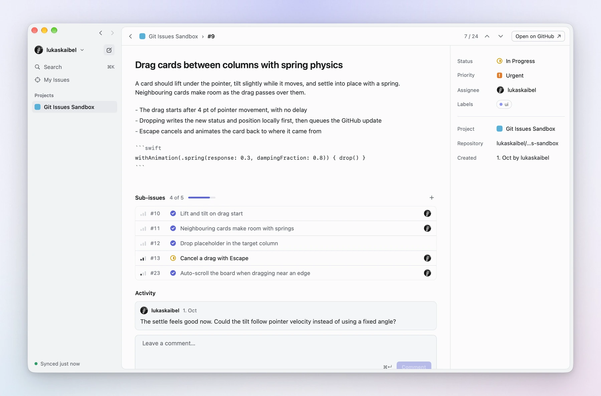
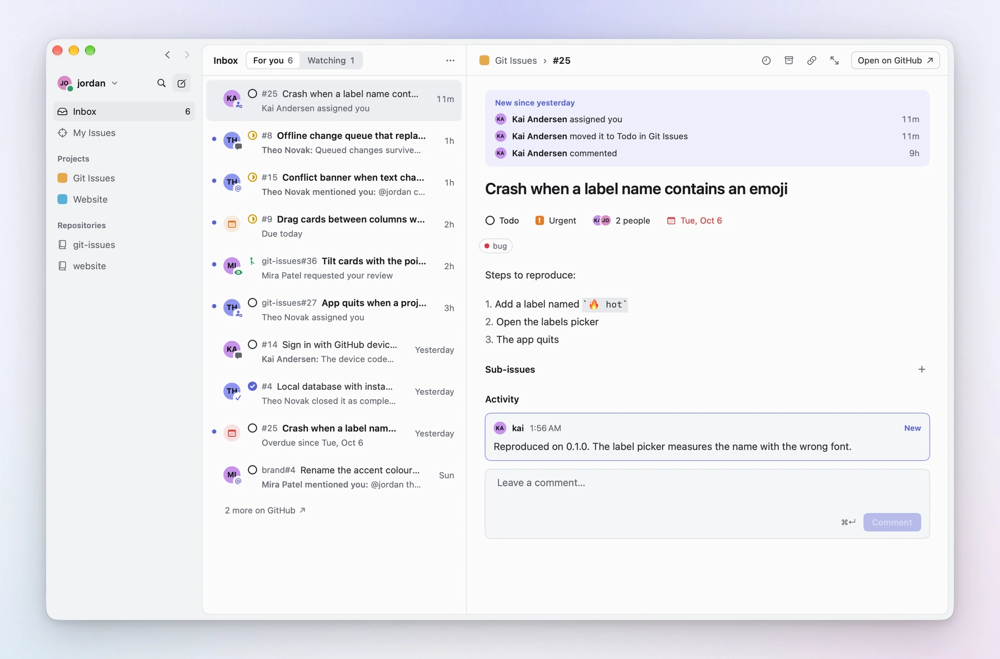
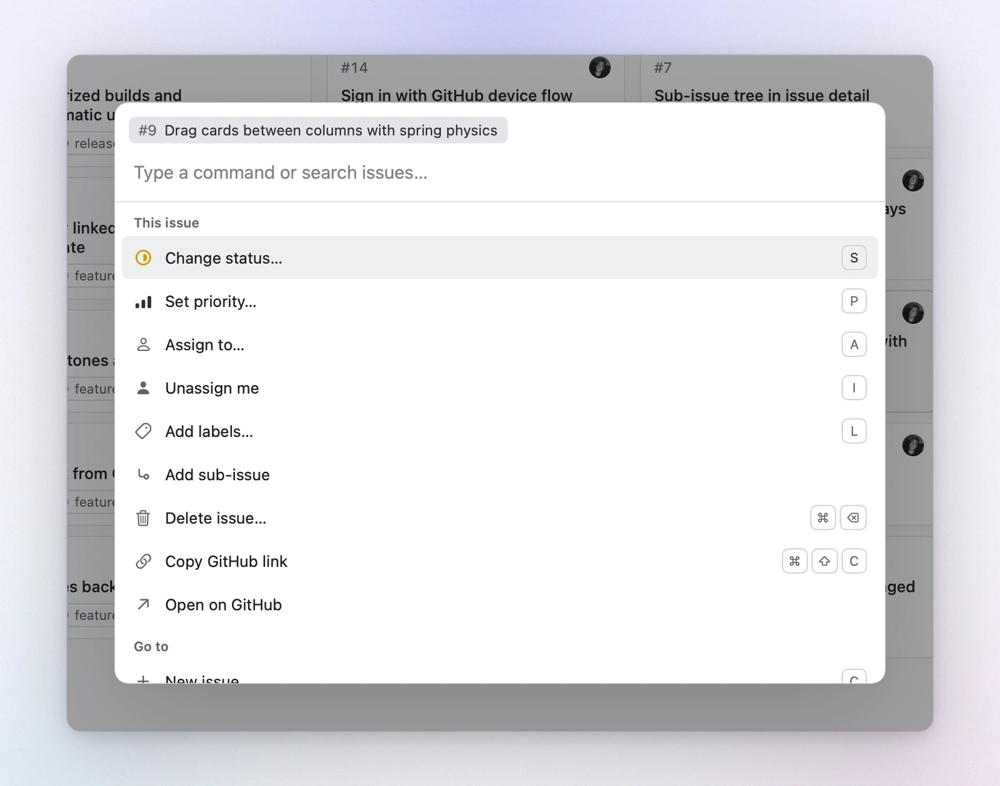
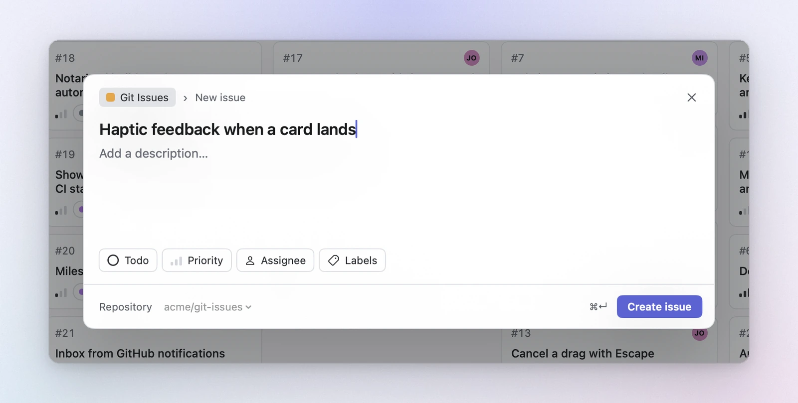
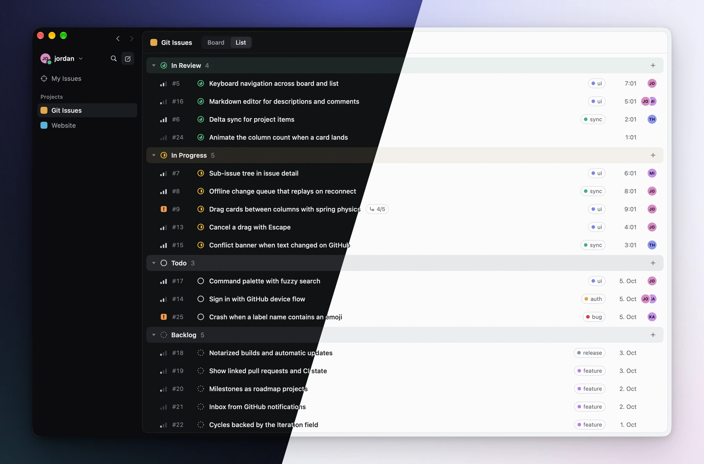
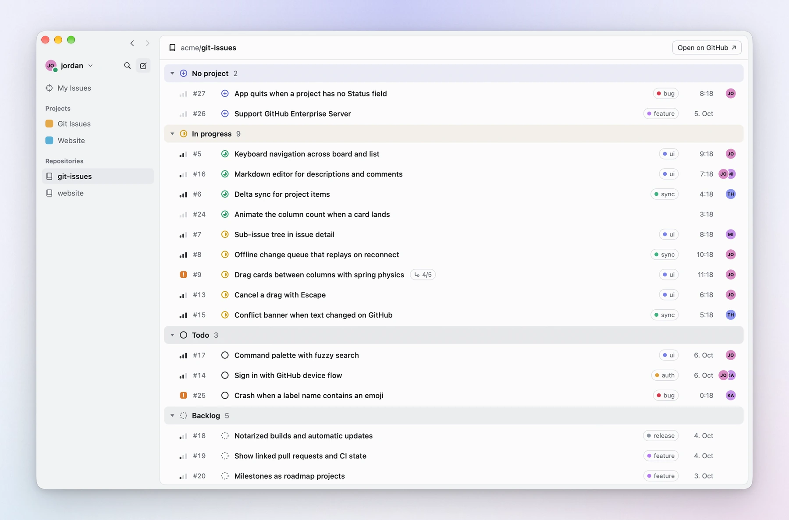
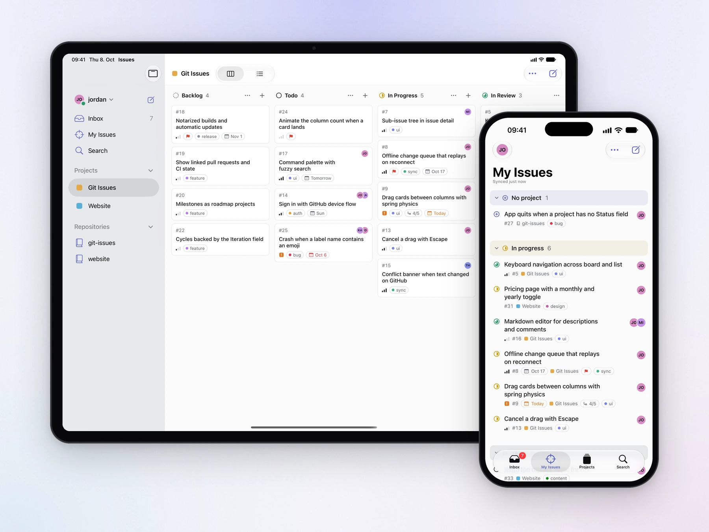
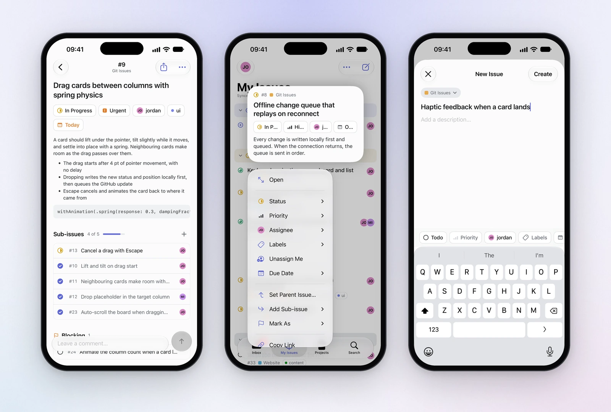

<p align="center">
  <picture>
    <source media="(prefers-color-scheme: dark)" srcset="Design/icon-dark.png">
    
  </picture>
</p>

<h1 align="center">Issues</h1>

<p align="center">
  <b>A fast, native app for GitHub Issues on Mac, iPhone and iPad</b>, with the board, keyboard flow and polish of Linear.<br>
  Everything stays in GitHub, so teammates who don't use the app notice nothing.
</p>

<p align="center">
  
  
  
  
  <a href="LICENSE"></a>
  <a href="CHANGELOG.md"></a>
</p>

<p align="center">
  <a href="#a-quick-tour"><b>Tour</b></a> &nbsp;·&nbsp;
  <a href="#iphone-and-ipad"><b>iPhone and iPad</b></a> &nbsp;·&nbsp;
  <a href="#getting-started"><b>Getting started</b></a> &nbsp;·&nbsp;
  <a href="#using-it"><b>Shortcuts</b></a> &nbsp;·&nbsp;
  <a href="CHANGELOG.md"><b>Changelog</b></a> &nbsp;·&nbsp;
  <a href="https://lukaskaibel.github.io/issues-for-github/"><b>Website</b></a>
</p>

<br>

<picture>
  <source media="(prefers-color-scheme: dark)" srcset="Design/screenshots/hero-dark.webp">
  
</picture>

> **New: Issues for iPhone and iPad.** The same app, built from the same project, with the same sync, offline
> queue and actions: lists with swipes and the issue menu on iPhone, the board with drag and drop on iPad.
> [See it below.](#iphone-and-ipad)

> **Status: early.** Version 0.1.0 covers the daily work of moving, editing and creating issues on the Mac; the
> iPhone and iPad app comes with 0.2.0. There are no downloadable builds yet; you build it from source (five minutes,
> see below).

## Why

GitHub Issues holds the data most teams already have. Its interface is slow to drive: every status change is a
page load and a menu. This app puts a native, keyboard-first front end on the same data. It reads and writes
GitHub Projects, issues, sub-issues, labels, assignees and comments, and stores nothing anywhere else.

## A quick tour

### A board you can pick up

Drag a card and it lifts off the board, tilts with the motion and settles with a spring, while its neighbours make
room. Press Esc mid-drag and it goes back to where it came from. The move shows in the same frame and reaches
GitHub in the background.

<picture>
  <source media="(prefers-color-scheme: dark)" srcset="Design/screenshots/drag-dark.webp">
  
</picture>

Every property is one click away: click a card's priority, status, labels, assignees or sub-issue count and a
dropdown opens right there. Type to filter, press a number to pick. Right-click a card for everything at once.

### Issues that read well

Descriptions are Markdown, edited in place: click and type. One with a table, a checklist, code or a Mermaid diagram
is drawn the way GitHub draws it, with checkboxes that tick; a click on the text brings up the Markdown. Sub-issues come
with a progress bar, comments sit below, and status, priority, assignees and labels are in the sidebar. Step to the
next issue with the arrows at the top.

<picture>
  <source media="(prefers-color-scheme: dark)" srcset="Design/screenshots/issue-dark.webp">
  
</picture>

### An inbox for what changed

The Inbox shows what happened that concerns you, as Linear's does: who assigned you, mentioned you, commented, asked
for your review or closed an issue you follow. It is GitHub's own notifications, so what you read or archive here is
read or done on github.com and on your other devices too. Pick one and its issue opens beside the list, with what's
new on top and the new comment marked; change it right there, and press S to put one that's on none of your boards
onto one. J and K move on, U marks read or unread, E archives and H snoozes until later.

<!-- The picture comes with the next run of Tools/readme-images.sh, which makes inbox-light.webp and inbox-dark.webp;
     take this comment away then.
<picture>
  <source media="(prefers-color-scheme: dark)" srcset="Design/screenshots/inbox-dark.webp">
  
</picture>
-->

### Keyboard first

⌘K opens the command palette: every action, and a search across your issues. Single keys act on the issue you
hover or reach with the arrow keys: `S` status, `P` priority, `A` assignee, `L` labels, `I` assign to me.

<picture>
  <source media="(prefers-color-scheme: dark)" srcset="Design/screenshots/palette-dark.webp">
  
</picture>

`C` starts a new issue wherever you are. Type the title, set its properties, and ⌘↵ creates it.

<picture>
  <source media="(prefers-color-scheme: dark)" srcset="Design/screenshots/new-issue-dark.webp">
  
</picture>

### A list, in light or dark

The list groups issues by status. Each header stays pinned while you scroll through its section and folds it with
a click. The app follows the system appearance, or stays light or dark if you prefer.



### Every issue, on a board or not

An issue someone opened straight in a repository isn't lost because nobody put it on a board. The sidebar lists the
repositories your boards use, like the teams in Linear, and each shows all its issues, grouped by status like My
Issues. Those on no board come first, under **No project**: click the circle with the plus (or press `S`), pick a
column, and the issue is on the board. My Issues shows everything assigned to you, on a board or not.

<picture>
  <source media="(prefers-color-scheme: dark)" srcset="Design/screenshots/repository-dark.webp">
  
</picture>

## iPhone and iPad

<picture>
  <source media="(prefers-color-scheme: dark)" srcset="Design/screenshots/devices-dark.webp">
  
</picture>

The iPhone and iPad app is the same app as the Mac's, built from the same project: sync, offline queue, conflict
handling and every action are shared code, and so are the colours, status circles, priority bars, labels and avatars.
The interface uses the system's own parts.

<picture>
  <source media="(prefers-color-scheme: dark)" srcset="Design/screenshots/iphone-dark.webp">
  
</picture>

- **iPhone:** a list per project, per repository and My Issues, grouped by status, with sections that fold and
  headers that stay pinned. Tabs for the Inbox (with its count), My Issues, Projects (with the repositories below the
  projects) and Search. Swipe right to mark an issue done, swipe left to assign it to yourself or delete it, touch and
  hold for the same menu as the Mac's right-click. In the Inbox, swipe right to read and left to snooze or archive. In
  an issue, the title and description are edited in place (Markdown is styled as you type; tables, checklists, code and
  Mermaid diagrams are drawn until you tap them), the properties are chips under the title, and the comment field stays
  at the bottom as in Messages.
- **iPad:** the tabs become a sidebar with every project and repository as an entry, as on the Mac. Projects open as a board or a
  list; cards are moved with drag and drop (touch and hold, then drag). An issue shows its properties in a column
  beside it, and the Inbox shows the selected issue beside its list, as in Mail. With a keyboard, the Mac's shortcuts
  work: J and K, S P A L I, ⌘1 ⌘2 ⌘3, ⌘K, ⌘N, ⌘R, ⌘[ and ⌘↵, and in the Inbox U, E, H and ⇧S.
- **Sample data:** "Explore with Sample Data" on the sign-in screen shows two sample projects without a GitHub account.
  Nothing there is sent anywhere.
- **In the background:** changes made just before locking the phone are still sent, and iOS refreshes the app now and
  then so it opens up to date, the Inbox included. There are no push notifications: GitHub can't push to an app
  without a server of its own, which Issues deliberately doesn't have.

## What it does

- **Board and list** for every GitHub Project you can see, plus **My Issues**: everything assigned to you.
- **Every issue of your repositories**, also those on none of your boards, which one click puts on one.
- **An Inbox** with GitHub's notifications about issues and pull requests: who did what, the issue beside it, and
  read, archive, snooze and unsubscribe in one key. Read and archived are the same on github.com.
- **Instant.** Every change is written to a local database first and shows in the same frame. GitHub is updated in
  the background.
- **Works offline.** Changes queue up and are sent when the connection returns.
- **Careful with other people's work.** Changes are sent field by field, descriptions edited in two places are
  merged, and when a merge isn't possible nothing is overwritten: you choose.
- **Status columns are yours to shape.** Add, rename, recolour and remove columns from the board, and drag a column
  by its header to move it; they are the project's Status field on GitHub. In the list, drag a section by its header
  to arrange the list your way (that order is a preference on your Mac and leaves GitHub alone).
- **GitHub's Markdown.** Headings, lists, code, tables, checklists that tick and Mermaid diagrams, drawn natively
  in the app's type and colours.
- **Keyboard first.** Single keys change status, priority, assignee and labels. Back and forward work like a
  browser: ⌘[ and ⌘], the side buttons of a mouse, or a two-finger swipe.
- **Native.** Swift and SwiftUI, with AppKit where it matters for smoothness. Apple silicon only.
- **On iPhone and iPad too.** One app for all three: the same sync, offline queue and actions, with an interface
  built from the system's own parts (see above).

## How it maps to GitHub

Nothing is invented on top of GitHub. Each concept is the GitHub feature it looks like:

| In the app | On GitHub |
|---|---|
| Board | A GitHub Project |
| Columns | The project's **Status** field |
| Moving a card to a "done" or "cancelled" column | Status changes, and the issue is closed as *completed* or *not planned* |
| Priority | A single-select project field named **Priority** (the app can add it for you) |
| Card order | The item's position in the project |
| Repositories in the sidebar | The repositories linked to your projects, and those their issues come from |
| No project | An issue that is in none of your projects; adding it to one is GitHub's *Add to project* |
| Sub-issues, labels, assignees, comments | The native GitHub features |
| Inbox | Your GitHub notifications about issues and pull requests; read and archived (GitHub's *Done*) are the same there |

Boards show the issues in their project; a repository shows all its open issues and those closed in the last four
weeks, on a board or not. My Issues shows the open issues assigned to you anywhere on GitHub. The Inbox also shows
issues and pull requests from other repositories that GitHub tells you about, and can put them on a board. What a
column means (backlog, in progress, done, cancelled) is inferred from its name, since GitHub stores only the label.

## Offline and conflicts

GitHub cannot push changes to a desktop app, so the app asks for changes every 15 seconds while it is in front, and
immediately when you return to it. Other people's changes therefore appear with a short delay. The Inbox asks for new
notifications at the pace GitHub sets, about once a minute; when nothing changed, that costs nothing against GitHub's
rate limit.

The dot on your avatar at the top of the sidebar shows how syncing is going: green when everything is on GitHub, the
accent colour while your changes go out, an amber ring when you're offline, and amber when something needs you. Hover
it to see when the app last synced. When you're offline, a change needs your decision or syncing fails, a card at the
bottom of the sidebar says so and offers the next step (show the waiting changes, open the issue, try again). The rest
of the time the bottom of the sidebar stays empty.

When you and someone else change the same issue:

1. **Different fields:** both changes stick. You set the priority, they move the card; nobody loses anything.
2. **The same field:** yours is applied when you reconnect, and a notice offers to switch to theirs.
3. **The same description or title:** edits to different lines are merged. If they overlap, your version is kept on
   screen but not sent until you pick "Keep mine" or "Use the GitHub version".
4. **The issue was deleted or removed from the project:** your queued changes are dropped and you are told.

## Getting started

### Requirements

- A Mac with Apple silicon running macOS 27 or later
- Xcode 27 or later
- A GitHub account with at least one [Project](https://docs.github.com/issues/planning-and-tracking-with-projects)

### Build and run

```bash
git clone https://github.com/lukaskaibel/issues-for-github.git
cd issues-for-github
open GitIssues.xcodeproj
```

Choose **My Mac**, an iPhone or iPad simulator, or your own device as the destination and press **Run** (⌘R) in Xcode.
Dependencies are fetched automatically on the first build. Running on your own iPhone or iPad needs your team in
`Config/Local.xcconfig`; the simulator doesn't.

To use the app day to day without Xcode, build an optimised copy instead. The script quits a running copy and opens
the new one, so you can run it again after pulling changes:

```bash
Tools/run-release.sh
```

Without any setup the app is signed to run on your Mac only, which is all a local build needs. To sign with your own
Apple Developer team, copy `Config/Local.xcconfig.example` to `Config/Local.xcconfig` and fill in your team ID.

### Releasing to the App Store

Releases go through [fastlane](https://fastlane.tools), for the Mac, iPhone and iPad together. It signs in to App Store
Connect with an API key, so there are no Apple ID prompts, and signs the builds with your team's Apple Distribution
certificate from the keychain and App Store profiles it fetches with the key. The first Mac build also creates a Mac
Installer Distribution certificate for the package; macOS then asks once whether it may be used (Always Allow). Once:

1. Create the app in App Store Connect for iOS and macOS with the bundle identifier `com.lukaskbl.GitIssues`, and set
   the few things fastlane can't ([Design/app-store.md](Design/app-store.md) lists them).
2. Copy `fastlane/.env.secret.example` to `fastlane/.env.secret` and fill in the API key and the contact for App Review.
3. Set `GITHUB_CLIENT_ID` in `Config/Local.xcconfig`, so the builds offer "Sign in with GitHub".
4. Run `bundle install`.

Then:

```bash
bundle exec fastlane screenshots   # the App Store screenshots of the iPhone, iPad and Mac apps, on the sample data
bundle exec fastlane beta          # build the Mac, iPhone and iPad apps and upload them to TestFlight
bundle exec fastlane submit        # submit those builds for review once they're tested in TestFlight
bundle exec fastlane release       # or all in one: build, upload texts and screenshots, and submit
```

The texts are in `fastlane/metadata`; `bundle exec fastlane metadata` uploads them with the screenshots and nothing
else. `bundle exec fastlane ios <lane>` or `mac <lane>` does one platform. The Mac's App Store build runs in the App
Sandbox, as the Mac App Store requires, and leaves out the GitHub CLI sign-in, which can't work there; **Product ›
Archive** in Xcode makes the same build. Without an API key, `Tools/testflight.sh` and `Tools/testflight-mac.sh` upload
a build with the Apple ID under Xcode › Settings › Accounts.

### Signing in

The sign-in screen offers up to three ways to sign in, depending on your setup, and sample data:

| Option | When to use it |
|---|---|
| **Use my GitHub CLI login** | You have [`gh`](https://cli.github.com) installed and signed in. Nothing to configure. If projects don't load, run `gh auth refresh -s project,read:org`. Not in the App Store build. |
| **Personal access token** | Create a classic token with the `repo`, `project` and `read:org` scopes. It is stored in your Mac's keychain. Fine-grained tokens can't read notifications, so the Inbox stays empty with one. |
| **Sign in with GitHub** | Shown when the build has an OAuth client ID. Register a GitHub OAuth app with the device flow enabled and set its client ID as `GITHUB_CLIENT_ID` in `Config/Local.xcconfig`. |
| **Explore with Sample Data** | Two sample projects to try everything without a GitHub account. Nothing there is sent anywhere; leave them from the account menu. |

On iPhone and iPad there is no GitHub CLI; sign in with GitHub or a token there, or let the Mac's login carry over:

- **The login is shared through iCloud Keychain.** Signed in on the Mac, the iPhone and iPad sign in by themselves (and
  the other way round). The Mac needs a build signed with your team for that: set `GI_MAC_ENTITLEMENTS` in
  `Config/Local.xcconfig` (see the example file). Signed in with the GitHub CLI, the Mac asks once whether to share it.
- **Sign Out** signs out of one device. **Sign Out Everywhere** removes the login from iCloud Keychain, which signs
  out all of them.

Your token never leaves your devices except to talk to `api.github.com`. There is no server and no analytics.

## Using it

Hover an issue or move to it with the arrow keys, then:

| Key | Action |
|---|---|
| `⌘K` or `/` | Command palette: run a command or jump to an issue |
| `C` or `⌘N` | New issue |
| `S` `P` `A` `L` | Change status, priority, assignee, labels; `S` puts an issue on no board onto one |
| `I` | Assign to me, or unassign |
| `↑` `↓` or `J` `K` | Move through issues; `←` `→` change column on the board |
| `Return` | Open the issue; `Esc` goes back, to the parent if you came from it |
| `Space` | Peek at the issue without leaving the board or list; `J` `K` move the peek along |
| `X` | Pick the issue for a change to several at once; `⇧↑` `⇧↓` or `⇧J` `⇧K` pick a run, `⌘A` picks all |
| `⌘[` `⌘]` | Back and forward (also mouse side buttons and two-finger swipe) |
| `G` then `B` / `L` / `M` / `I` / `P` | Go to board, list, My Issues, the Inbox, or switch project or repository |
| `⌘1` `⌘2` `⌘3` | Board, list, My Issues |
| `⌘↵` | Save a description, send a comment, create the issue |
| `⌘⇧C` / `⌘⇧O` | Copy the issue's GitHub link / open it on GitHub |
| `⌘⇧.` | Copy a branch name for the issue, as GitHub suggests it |
| `⌘⌫` | Delete the issue (asks first; needs admin rights in the repository) |
| `⌘R` | Sync with GitHub now |
| `⌘,` | Settings: light, dark or system appearance, and the app icon |

In the Inbox:

| Key | Action |
|---|---|
| `J` `K` or `↑` `↓` | Next or previous notification; its issue opens beside the list and counts as read |
| `Return` | Open the issue full size; `Esc` goes back to the Inbox |
| `U` / `⌥U` | Mark read or unread / mark everything read |
| `E` or `⌫` | Archive (GitHub's *Done*); `⌘Z` or the message at the bottom undoes it for a few seconds |
| `⇧⌫` | Archive everything read |
| `H` | Snooze until later today, tomorrow, next week or a date |
| `⇧S` | Unsubscribe: GitHub tells you about it again only if you're mentioned or comment |
| `S` `P` `A` `L` `I` | Change the issue, as anywhere else |

`⌘`-click and Shift-click pick several notifications to read, snooze or archive together. Right-click one for
everything at once.

Click an issue's priority, status, labels, assignees or sub-issue count to change it in place, or right-click
it for everything at once. The sub-issue count lists the sub-issues, whose status, priority and assignee change
right there too. In the list, click a section header to fold it; Option-click folds them all.

A description with a table, a checklist, code or a Mermaid diagram is drawn as on GitHub. Click a checkbox to tick it;
click anywhere else to edit the Markdown, and `Esc` or `⌘↵` draws it again.

On the board, drag cards between and within columns; press `Esc` mid-drag to put a card back. Drag a column by its
header to reorder it, double-click its name to rename it, right-click it for its menu (rename, colour, delete), and
use **Add column** at the right end of the board.

To change several issues at once, pick them with `X`, the checkbox at the start of a list row, ⌘-click or
Shift-click. A bar at the bottom then sets status, priority, assignee or labels for all of them, and so do the
usual keys, dropdowns and right-click menu. `Esc` clears the pick.

Right-click a project or repository in the sidebar to hide it; hidden ones wait, folded away, at the end of their
list. Click your name at the top of the sidebar for the account menu: Sync Now, changes still waiting to be sent,
appearance, settings and signing out. It works with the arrow keys like any menu.

## Using it on iPhone and iPad

| Gesture | Action |
|---|---|
| Tap a section header | Fold it in or out |
| Swipe right on an issue | Done, or reopen |
| Swipe left on an issue | Assign to me (or unassign), delete |
| Touch and hold an issue | Status, priority, assignee and labels as submenus (Add to Project for an issue on no board); copy link, share, open on GitHub, delete |
| Pull down | Sync with GitHub now |
| Tap the description | Edit it in place; the bar above the keyboard adds bold, italics, code, lists and links |
| Tap a drawn description (table, checklist, code, diagram) | Show its Markdown; tap again to edit. Tap a checkbox to tick it |
| Touch and hold a card, then drag (iPad) | Move it to another place or column |
| Swipe right in the Inbox | Read, or unread |
| Swipe left in the Inbox | Archive, or snooze |
| Touch and hold in the Inbox | Read, snooze, archive, unsubscribe, and the issue's status, priority, assignee and labels |

## Not there yet

Cycles, roadmaps, linked pull requests, file uploads, real-time updates and notifications on screen for new Inbox
entries are planned but not built. Also good to know in 0.1.0:

- Pull requests and draft issues appear on the board and can be moved, but their text is read-only.
- Images in descriptions of private repositories may not load.
- Filtering and saved views don't exist yet.

## For contributors

```
GitIssues/                   The app target for Mac, iPhone and iPad: a few lines that show the scene, and the icons
GitIssuesUITests/            UI tests of the iPhone and iPad app, on the sample data
Packages/GitIssuesKit/
  Sources/GitIssuesKit/
    API/                     GitHub GraphQL client and sign-in
    Model/                   Records, and what column and priority names mean
    Store/                   The local SQLite database (GRDB), and the sample data
    Sync/                    Sync engine, queued changes, three-way text merge
    UI/Shared/               The model and every action, design tokens, glyphs, Markdown, the board's cards
    UI/Mac/                  The Mac's window, sidebar, AppKit issue table, palette, dropdowns and keys
    UI/iOS/                  The iPhone and iPad tabs, lists, issue screen, sheets, search and sign-in
  Sources/gi-cli/            Command-line tool for exercising sync without the UI
  Tests/                     Unit tests
Config/                      Build settings, Info.plist and entitlements
Design/                      The violet icon, earlier icon variants, screenshots, social preview
Website/                     The website on GitHub Pages: home, privacy policy, terms, support, Impressum
Tools/                       Icons, release builds, iOS tests, App Store and README screenshots, TestFlight uploads
fastlane/                    App Store releases: lanes, the listing's texts and the age rating
```

Everything under `UI/Shared` and below `API`, `Model`, `Store` and `Sync` runs on all three devices, so a change there
applies everywhere. `UI/Mac` and `UI/iOS` are compiled for their platform only.

Run the unit tests, and the iPhone and iPad UI tests (they create their simulators on first use):

```bash
cd Packages/GitIssuesKit && swift test
```

```bash
Tools/test-ios.sh
```

The images in this README are made by a script: it runs the Mac app on the sample data, records the scenes and lays
them out in light and dark, together with the iPhone and iPad screenshots from `Tools/app-store-screenshots.sh`, and
makes the website's pictures from the same screenshots. Run it again when a change shows in one of them (it brings the
app to the front for about two minutes):

```bash
Tools/readme-images.sh
```

The [website](https://lukaskaibel.github.io/issues-for-github/) is plain HTML and CSS in `Website/`, without a build
step; `.github/workflows/website.yml` publishes it to GitHub Pages when it changes on `main`. To look at it locally:

```bash
python3 -m http.server --directory Website
```

`gi-cli selftest` runs every kind of write end to end against GitHub. It only touches a project titled
"Git Issues Sandbox", which you create yourself with Status and Priority fields. `gi-cli inbox` lists your
notifications the way the Inbox reads them and changes nothing; `gi-cli inbox read|archive <thread id>` only acts on
notifications from the sandbox project's repositories.

See [CONTRIBUTING.md](CONTRIBUTING.md) for how to propose changes. The design choices behind sync are documented in
the source, starting with `Sync/SyncEngine.swift` and `Sync/Mutation.swift`.

## Versions

The project follows [semantic versioning](https://semver.org). Every release is tagged (`v0.1.0`) and described in
the [changelog](CHANGELOG.md). Until 1.0, minor versions may change behaviour.

## Acknowledgements

Built with [GRDB](https://github.com/groue/GRDB.swift), [MarkdownUI](https://github.com/gonzalezreal/swift-markdown-ui)
with [swift-cmark](https://github.com/swiftlang/swift-cmark), and
[BeautifulMermaid](https://github.com/lukilabs/beautiful-mermaid-swift), which lays diagrams out with
[elk-swift](https://github.com/lukilabs/elk-swift) (Eclipse Public License 2.0; its source is at that link). The
interaction design is inspired by [Linear](https://linear.app).

Issues is an independent project and is not affiliated with, endorsed by, or sponsored by GitHub or Linear.

## License

[MIT](LICENSE) © Lukas Kaibel
